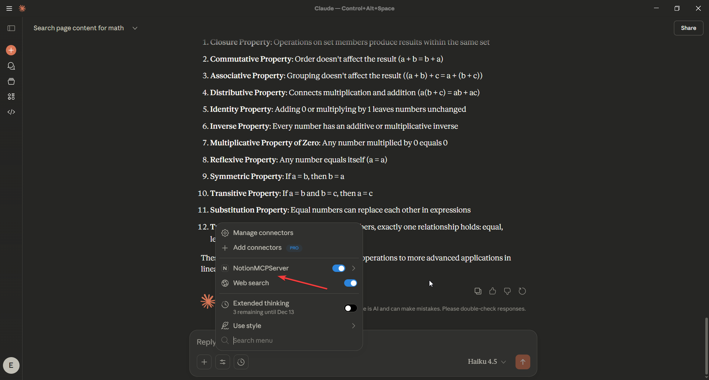
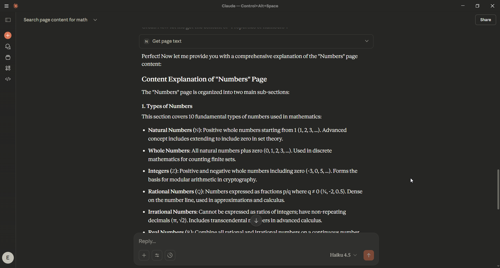
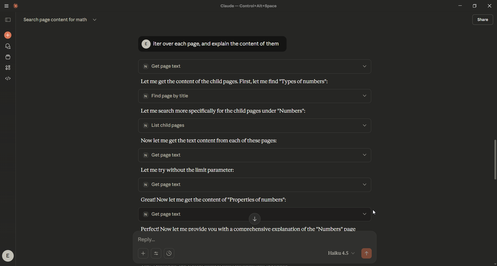
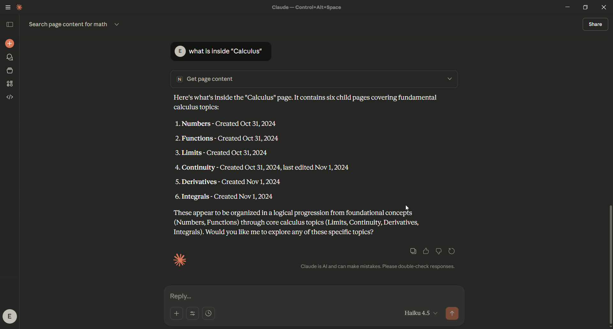
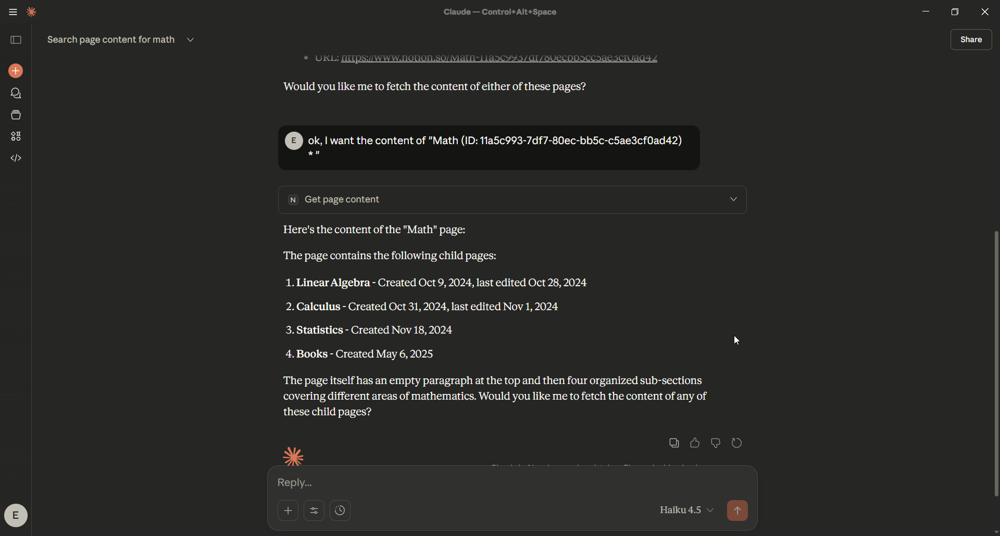
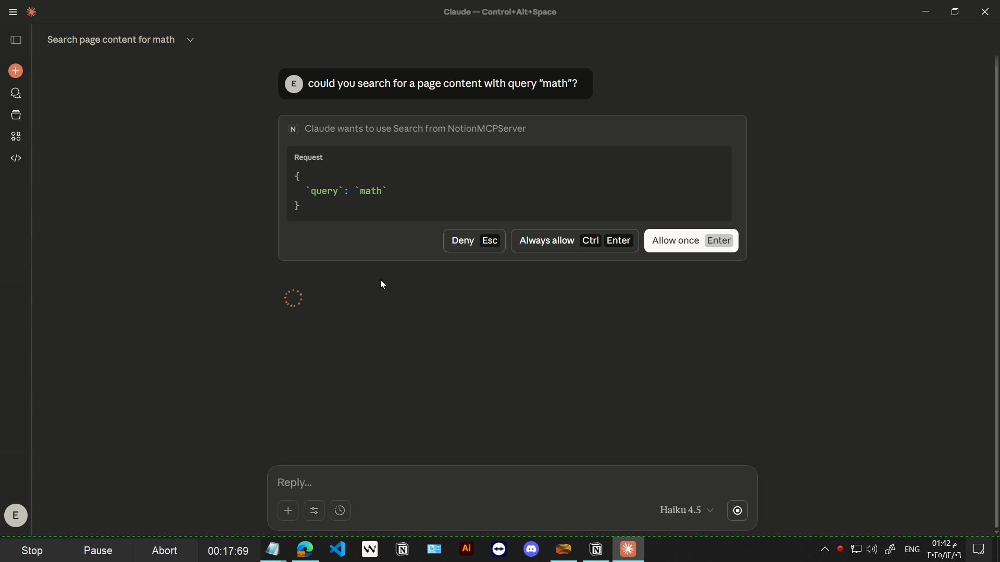

# **NotionMCP — AI-Powered Notion Assistant via MCP**

NotionMCP is a **Modular Context Protocol (MCP) server** that exposes advanced Notion search, reading, summarization, and emotion-analysis tools to any MCP-compatible LLM client such as **Claude Desktop**.

This project turns your Notion workspace into an intelligent, queryable knowledge system, giving your AI assistant the ability to:

* Search pages and databases with precision
* Read and extract block-level content
* Summarize large or complex Notion pages
* Analyze sentiment/emotion of page text
* Build AI workflows on top of your Notion data
* Operate securely using the MCP standard

It is built for:

* Developers
* Researchers
* Data science teams
* Knowledge-intensive organizations
* Anyone wanting an AI agent deeply integrated with Notion

---

# **Features**

### **Intelligent Notion Search**

* Title search
* Page/database filtering
* Pagination + streaming search
* User discovery tools

### **Advanced Content Reading**

* Extract readable text from pages
* Traverse block structures
* Read pages by name or ID
* Support for headings, lists, checkboxes, callouts, quotes, etc.

### **AI Summaries & Emotion Analysis**

* Abstractive summarization (T5)
* Emotion/tone classification (Transformers)
* Integrated into Notion workflows

### **Fully MCP-Compatible**

Works out-of-the-box with:

* Claude Desktop
* ChatGPT MCP mode
* Any MCP-compatible automation or agent

### **Clean, Modular Architecture**

* `search_tools.py`
* `read_tools.py`
* `ai_tools.py`
* Async Notion client layer with retries + rate-limit handling

---

# **Business Value**

NotionMCP upgrades Notion from a documentation space into a **scalable AI knowledge engine**.
It enables teams and organizations to operate faster, reduce manual overhead, and make better decisions by turning unstructured notes into actionable intelligence.

### **For Organizations**

* Automate summarization, research, onboarding, and documentation workflows
* Improve knowledge accessibility across teams and departments
* Standardize how information is consumed, summarized, and shared
* Reduce operational time spent searching or rewriting content
* Build internal AI agents capable of retrieving, processing, and analyzing company knowledge

### **For Technical Teams**

* Gain a robust async Notion API client with retry + backoff handling
* Extend MCP tools with custom AI models or internal logic
* Integrate Notion into broader AI, analytics, or automation pipelines
* Build reproducible and automated workflows on top of Notion pages
* Maintain full control over data by running tools locally

### **Strategic Outcomes**

* Faster decision-making
* Reduced cognitive load across technical and non-technical teams
* Stronger organizational memory and knowledge consistency
* A foundation for deployable AI assistants operating on real company data

---

# **Demo**

### **Video Demo**

[Click to view `./demo/1.mp4`](./demo/1.mp4)

### **Image Walkthrough**

1. 
2. 
3. 
4. 
5. 
6. 

---

# **Installation**

You may install using either:

## **Option A — Using `venv` (recommended for most users)**

### **1. Clone the repository**

```bash
git clone https://github.com/DeepActionPotential/NotionMCP.git
cd NotionMCP
```

### **2. Create and activate a virtual environment**

```bash
python -m venv .venv
```

Activate it:

**Windows**

```bash
.venv\Scripts\activate
```

**macOS/Linux**

```bash
source .venv/bin/activate
```

### **3. Install dependencies**

```bash
pip install -r requirements.txt
```

### **4. Run the MCP server**

```bash
python server.py
```

---

## **Option B — Installation using `uv`**

```bash
uv sync
uv run server.py
```

---

# **Configuring Claude Desktop**

Add the following to:

`claude_desktop_config.json`

```json
{
  "mcpServers": {
    "NotionMCPServer": {
      "command": "uv",
      "args": [
        "--directory",
        "your-own-server-file-directory",
        "run",
        "server.py"
      ]
    }
  }
}
```

Restart Claude Desktop.
You should now see all Notion tools available under the MCP Tools menu.

---

# **Environment Variables**

Create a `.env` file or export environment variables:

```
NOTION_API_KEY=secret_notion-api
HTTP-TIMEOUT=60
```

Your Notion integration must be shared with the pages or workspace you want to read.

---

# **Usage Examples**

Ask Claude:

* “Search Notion for pages about convolution.”
* “Summarize the Deep Learning page in 200 words.”
* “Extract the first 20 lines of the Metrics page.”
* “Analyze the emotional tone of the Vision page.”

Claude will automatically call MCP tools such as:

* `search`
* `iter_search`
* `get_page_text`
* `summarize_page_text`
* `get_page_sentiment`

---

# **Architecture**

```
NotionMCP
│
├── tools/
│   ├── search_tools.py
│   ├── read_tools.py
│   └── ai_tools.py
│
├── core/
│   └── notion_clients.py
│
├── services/
│   ├── summarization_service.py
│   └── text_emotion_service.py
│
├── demo/
│
└── server.py
```

---

# **Contributing**

Contributions are welcome:

* New AI models
* Additional Notion endpoints
* Performance improvements
* New MCP tools

Please open an issue or submit a PR.

---

# **License**

MIT License — free for commercial and private use.

